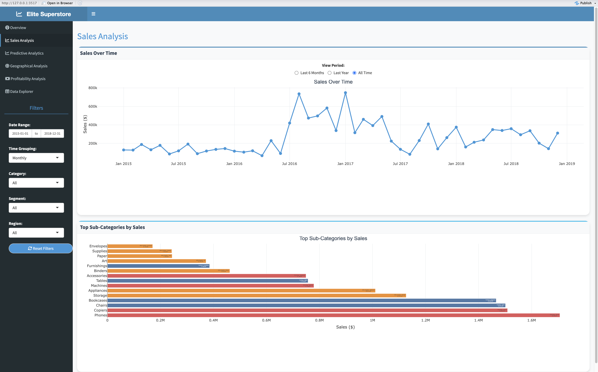
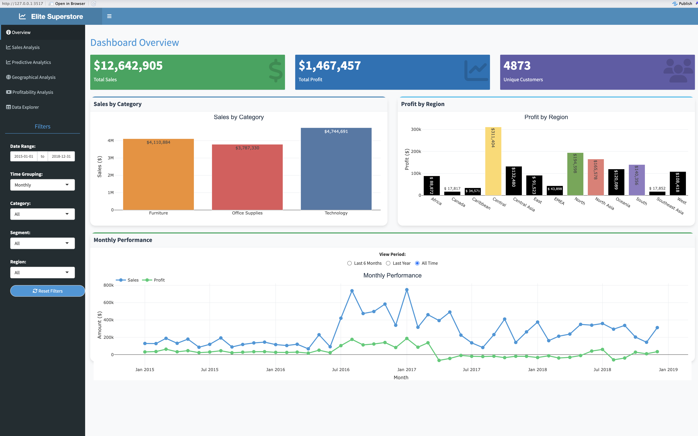
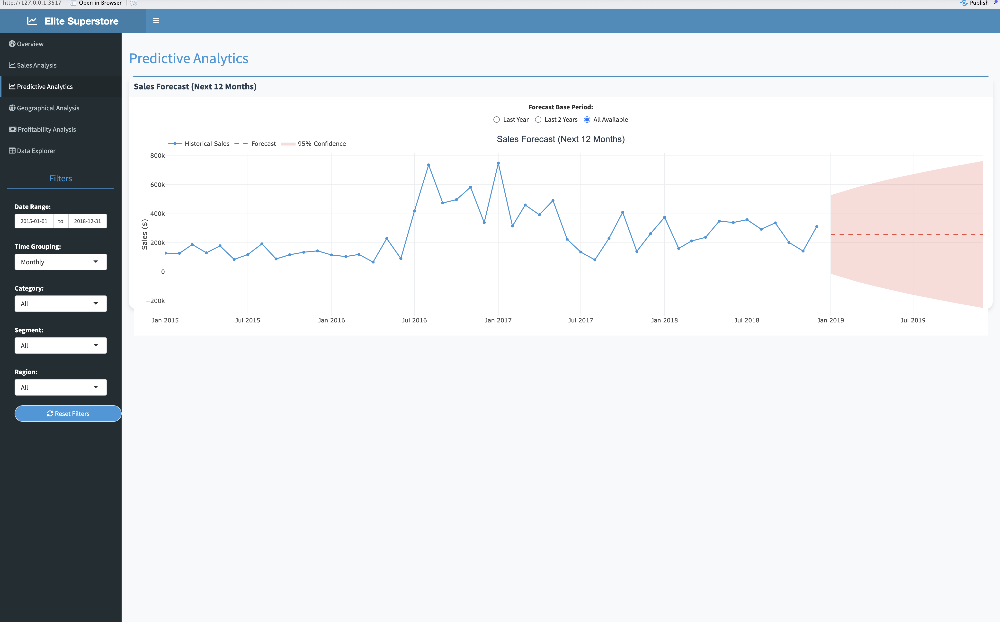
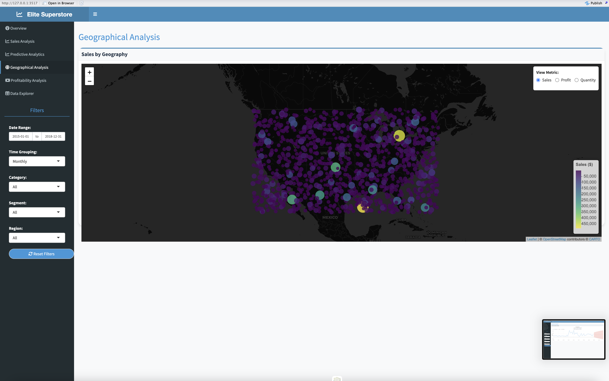
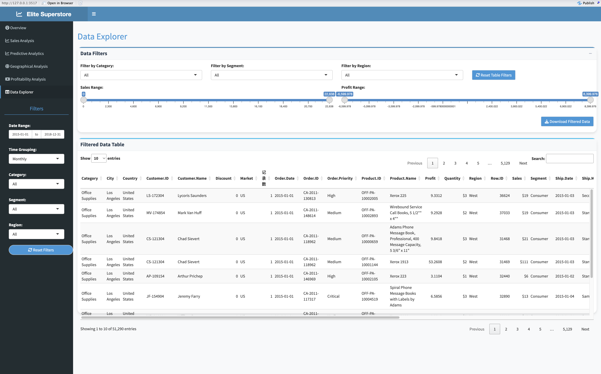

# Super Store Analysis Shiny App

**Author:** Mr. Darpan Radadiya
**Date:** March 31, 2025
**Repository:** [https://github.com/darpanradadiya/Super\_store\_analysis\_Rshiny\_app.git](https://github.com/darpanradadiya/Super_store_analysis_Rshiny_app.git)

---

## 🚀 Project Overview

The **Super Store Analysis** Shiny application delivers a rich, end-to-end analytics experience for historical Superstore data (2015–2018). Users can:

* View executive-level KPIs (Sales, Profit, Customers)
* Dive into time-series sales trends and category breakdowns
* Generate and visualize a 12‑month sales forecast
* Explore geographic performance on an interactive map
* Drill into transaction-level details with on‑the‑fly filtering and export

This dashboard equips business leaders with actionable insights to optimize marketing, inventory, and regional strategies.

---

## 🎯 Key Features

### 1. Overview

* **KPI Cards**: Total Sales, Total Profit, Unique Customers
* **Bar Charts**: Sales by Category; Profit by Region

### 2. Sales Analysis

* **Sales Over Time**: Monthly time-series with selectable view windows (6 months, 1 year, all time)
* **Top Sub‑Categories**: Horizontal bar chart highlighting highest‐revenue product groups

### 3. Predictive Analytics

* **12‑Month Forecast**: ARIMA-based projection with 95% confidence interval
* **Training Window**: Choose last 1 year, last 2 years, or all historical data

### 4. Geographical Analysis

* **Leaflet Map**: Bubble map of Sales/Profit/Quantity by customer location

### 5. Data Explorer

* **Interactive Table**: Filter by Category, Segment, Region, Sales & Profit ranges
* **Export**: Download filtered dataset as CSV

---

## ⚙️ Installation & Usage

```bash
# 1. Clone repo
git clone https://github.com/darpanradadiya/Super_store_analysis_Rshiny_app.git
cd Super_store_analysis_Rshiny_app

# 2. Install R packages
R -e "install.packages(c('shiny','shinydashboard','shinydashboardPlus','ggplot2','plotly','leaflet','dplyr','readr','DT','lubridate','shinyWidgets'))"

# 3. Run the app
R -e "shiny::runApp('ALY_6070_Shiny_Application_Super_store.R')"
```

---

## 📈 Insights & Screenshots

> *All images are in the **`screenshots/`** folder.*

### 1. Dashboard Overview



**Insight:**

* **\$12.64 M** total sales and **\$1.47 M** profit indicate healthy margins.
* **Technology** category leads revenue—prioritize premium electronics promotions.
* **Central** region delivers highest profit—consider expanding regional campaigns here.

### 2. Sales Analysis



**Insight:**

* Noticeable sales peak in Q1 2017 suggests seasonal demand—align marketing pushes accordingly.
* **Phones**, **Copiers**, and **Chairs** top sub‑category performers—stock and cross-sell these products.

### 3. Predictive Analytics



**Insight:**

* Forecast shows moderate growth with widening confidence bands—plan inventory buffers.
* Use selectable training windows to simulate different market scenarios.

### 4. Geographical Analysis



**Insight:**

* High‑volume clusters in major metros—deploy location‑based promotions and logistics optimizations.
* Toggle between Sales/Profit/Quantity to uncover under‑served regions.

### 5. Data Explorer



**Insight:**

* Ad‑hoc filtering empowers analysts to slice by Category, Segment, Region, or Sales & Profit thresholds.
* Export functionality accelerates downstream reporting and model building.

---

## 📄 License

This project is released under the **MIT License**. Feel free to fork, extend, or raise issues on GitHub.
